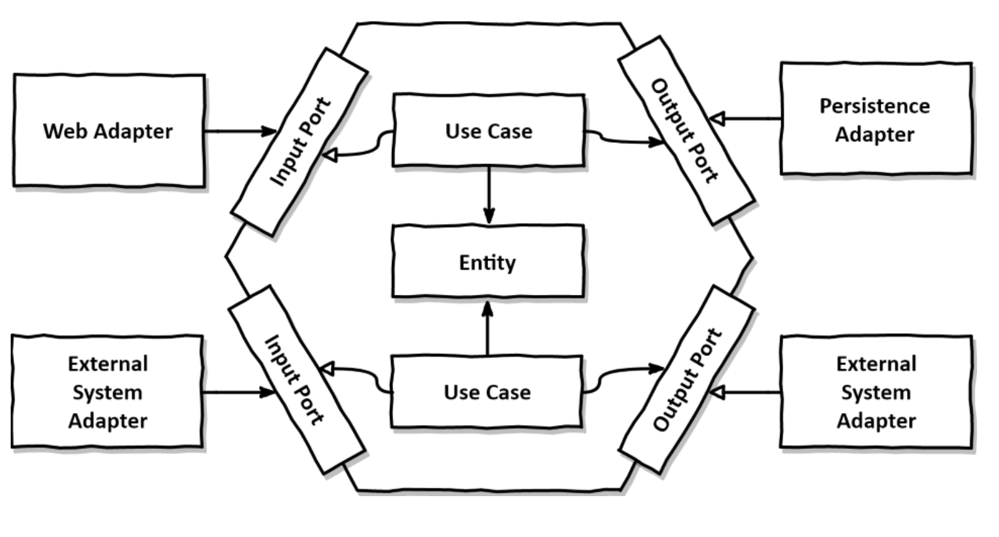

### 개요
- 도메인과 외부 구성요소의 결합도를 느슨하게 연결한다  
  - 비지니스 로직이 기술 요소에 의존하지 않도록 한다
  - 도메인을 독립적으로 테스트 한다 

--- 

### 구조


```
- groot.hexagonal
 - adapter
   - in
   - out  
 - application
  - port 
    - in
    - out
  - service  
 - domain 
 - config 
```
- 요약하면 
  - application.service 과 domain 에서 비지니스 로직을 처리하고  
  - port 아래 interface 를 통해서 adapter 를 사용하게 된다
  - adapter 가 수정되어도 비지니스 로직 코드에 변경이 일어나지 않는다 


--- 

### 코드 

- https://github.com/yslee1126/hexagonal.git

--- 

### 회고

- adapter 의 in/out 종류가 다양할 경우 이 구조에 큰 장점이 있을 것 같다
  - 그러나 보통의 단일 프로젝트에서 in 은 web rest api, out 은 orm 이 위치하고 종류가 다양할 일이 별로 없을 것으로 예상   
- 인터페이스 클래스가 많이 늘어났고 각 영역에 한정된 dto 가 별도로 필요하기 때문에 코드량이 전반적으로 많이 늘어났다 
- 그냥 layered 구조를 쓰는게 더 맞는 상황일 수도 있다는 생각이 든다
  - 업무 도메인에 따라서 hexagonal 구조의 필요성이 달라 질 것 같다 
